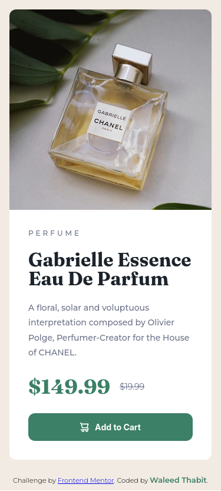
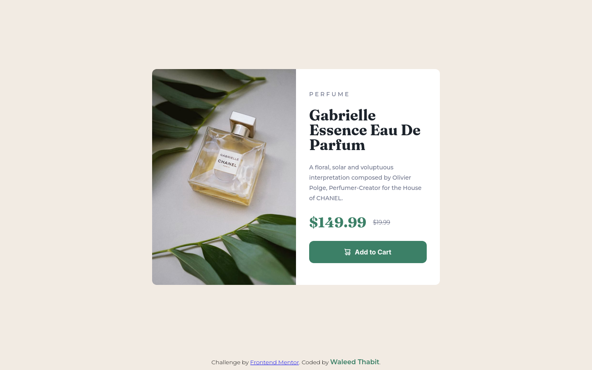
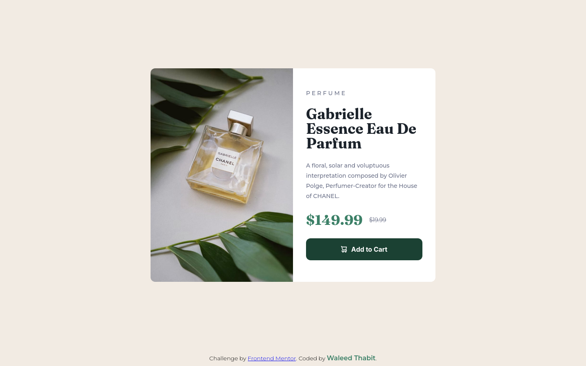

# Frontend Mentor - Product preview card component solution

This is a solution to the [Product preview card component challenge on Frontend Mentor](https://www.frontendmentor.io/challenges/product-preview-card-component-GO7UmttRfa). Frontend Mentor challenges help you improve your coding skills by building realistic projects.

## Table of contents

- [Overview](#overview)
  - [The challenge](#the-challenge)
  - [Screenshot](#screenshot)
  - [Links](#links)
- [My process](#my-process)
  - [Built with](#built-with)
  - [What I learned](#what-i-learned)
  - [AI Collaboration](#ai-collaboration)
- [Author](#author)

## Overview

### The challenge

Users should be able to:

- View the optimal layout depending on their device's screen size
- See hover and focus states for interactive elements

### Screenshot

Mobile:

Desktop:

Hover state:

### Links

- Solution URL: [https://github.com/waleed-thabit/product-card](https://github.com/waleed-thabit/product-card)
- Live Site URL: [https://waleed-thabit.github.io/product-card/](https://waleed-thabit.github.io/product-card/)

## My process

### Built with

- Semantic HTML5 markup
- CSS custom properties
- Flexbox
- CSS Grid
- Mobile-first workflow
- Vanilla HTML and CSS only, no frameworks

### What I learned

I didn't learn anything new in this project. It was mostly practice with things I already knew:

- **Grid for the overall layout**, more than Flexbox this time. I used it for the main two-column split on desktop, and to center the whole card on the page without relying on margin or padding hacks, and to keep the footer pinned to the bottom cleanly.
- **Logical border-radius properties** (`border-start-start-radius`, `border-end-end-radius`, etc.) instead of the physical `border-top-left-radius` style. I already knew these, but this project was a good excuse to use them, since the rounded corners move depending on whether the image is on the left or on top.
- **Two separate images for mobile and desktop** (as provided by the challenge), swapped with a media query. This could also be done with a single image and `aspect-ratio`/`object-fit`, but I went with the two images this time since that's what the challenge provided.
- **Focus-visible states:** the challenge asks for both hover and focus states. I made sure interactive elements use `:focus-visible` so the focus indicator only shows up for keyboard navigation, not for mouse clicks.

### AI Collaboration

I did not use AI to build this project. I used **Claude** only to help me write this README.

## Author

- GitHub - [@waleed-thabit](https://github.com/waleed-thabit)
- Frontend Mentor - [@waleed-thabit](https://www.frontendmentor.io/profile/waleed-thabit)
